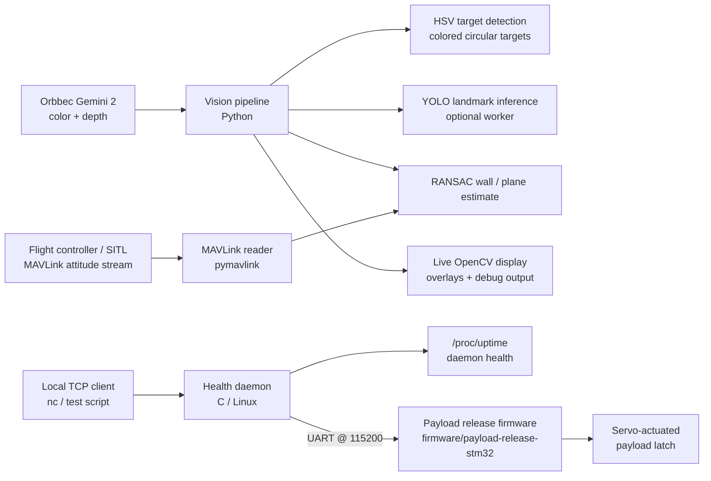

# Drone Onboard Systems

Onboard software for an autonomous drone system developed around the **AEAC Fire Reconnaissance UAS Competition**.

This repository covers software that runs on the drone outside the flight-controller firmware itself. It includes companion-computer services under `companion/` and payload-controller firmware under `firmware/payload-release-stm32/`. The current codebase covers perception, MAVLink attitude intake, payload-command support, daemon health reporting, payload-release firmware, and bench-test workflows.

## Current subsystems

- **Vision pipeline** (`companion/vision`): Python companion-computer pipeline for Orbbec Gemini 2 color/depth capture, HSV target segmentation, optional YOLO landmark inference, RANSAC wall/plane estimation, and MAVLink attitude input.
- **Health daemon** (`companion/health_daemon`): Linux C companion-computer daemon that exposes a localhost TCP command interface, reports basic health/uptime, bridges payload commands over UART, and provides simulation commands for bench testing without the payload MCU attached.
- **Payload release firmware** (`firmware/payload-release-stm32`): Embedded payload-controller firmware for a servo-actuated release mechanism. The firmware README documents a deterministic, safety-gated finite state machine with explicit `LOCKED`, `ARMED`, `RELEASING`, `RETRACTING`, and `FAULT` states.

## Repository layout

```text
.
├── README.md
├── companion/
│   ├── health_daemon/
│   │   ├── README.md
│   │   └── healthd.c
│   └── vision/
│       ├── README.md
│       ├── camera.py
│       ├── config.py
│       ├── demo.png
│       ├── main.py
│       ├── mavlink.py
│       ├── ransac_worker.py
│       ├── renderer.py
│       ├── segmentation.py
│       ├── shared_state.py
│       ├── vision_app.py
│       └── yolo_worker.py
└── firmware/
    └── payload-release-stm32/
        ├── README.md                # Firmware overview, UART protocol, FSM, and safety notes
        ├── architecture_diagram.png # Payload release state-machine diagram
        └── STM32 project files      # UART parsing, non-blocking FSM, servo timing, and fault handling
```

## System overview



The onboard software is split between the companion computer and embedded firmware targets. The companion computer is responsible for higher-level mission support services. The vision stack processes synchronized color/depth frames and uses MAVLink attitude data to support plane estimation. The health daemon provides a small localhost control surface for payload-command testing and UART forwarding. The payload-release firmware runs the embedded-side latch state machine close to the actuator hardware.

## `companion/vision`

Real-time vision pipeline for AEAC target and landmark perception.

Current capabilities:

- Starts an Orbbec Gemini 2 color/depth pipeline using `pyorbbecsdk`
- Aligns depth frames to the color stream
- Filters depth to a configured valid range of `20 mm` to `10000 mm`
- Detects colored circular targets with HSV masks and contour geometry
- Runs optional YOLO inference every configured interval after a target is detected
- Estimates target-to-landmark distances using depth-to-3D conversion
- Runs RANSAC on sampled depth points to estimate a dominant non-ground plane/wall
- Reads MAVLink `ATTITUDE` messages and stores pitch/roll for RANSAC
- Displays a live OpenCV feed with target/landmark annotations

See [`companion/vision/README.md`](companion/vision/README.md) for dependencies, run notes, configuration details, and current integration caveats.

## `companion/health_daemon`

Lightweight Linux daemon for payload-subsystem command handling and status reporting.

Current capabilities:

- Binds a local TCP command server to `127.0.0.1:5050`
- Accepts simple line-based commands from `nc` or a local test script
- Reports daemon liveness and Linux uptime from `/proc/uptime`
- Tracks accumulated daemon errors using a bitmask
- Attempts to open the configured payload MCU serial device at `115200` baud
- Forwards hardware commands such as `LOCK`, `ARM`, `RELEASE`, `RETRACT`, and `DISTANCE` over UART
- Provides `SIM_*` commands for daemon-only state-machine testing
- Handles `SIGINT` and `SIGTERM` for clean shutdown

See [`companion/health_daemon/README.md`](companion/health_daemon/README.md) for build instructions, command references, and simulation examples.

## `firmware/payload-release-stm32`

Payload release controller firmware for the embedded side of the payload subsystem.

Current capabilities documented by the firmware README:

- Runs a deterministic finite state machine for a servo-actuated latch
- Requires an armed state before release
- Uses explicit payload states: `LOCKED`, `ARMED`, `RELEASING`, `RETRACTING`, and `FAULT`
- Runs a timed release-to-retract sequence
- Provides a fault override path that retracts the latch and enters `FAULT`
- Communicates with the companion computer over UART

The firmware README documents a fixed-length ASCII UART command protocol with tokens such as `LOCK`, `ARMD`, `RELS`, and `STOP`. The companion health daemon currently exposes higher-level command names such as `LOCK`, `ARM`, `RELEASE`, `RETRACT`, and `DISTANCE`, so the daemon-to-firmware command mapping should be verified during integration.

This firmware is separate from the flight-controller stack. Flight control, stabilization, and autopilot behavior remain the responsibility of the flight controller and its firmware/software stack.

## Quick start

### Vision pipeline

```bash
cd companion/vision
python main.py
```

Before running, make sure the machine has:

- Orbbec Gemini 2 connected over USB 3
- Orbbec Python SDK / `pyorbbecsdk`
- `opencv-python`, `numpy`, `ultralytics`, and `pymavlink`
- A YOLO model matching `AppConfig.model_path` (`yolov10n.pt` by default)
- A MAVLink endpoint available at `udpin:localhost:14540`, or a local code stub if testing vision without the flight-controller/SITL link

### Health daemon

```bash
cd companion/health_daemon
gcc -Wall -Wextra -std=c11 -o healthd healthd.c
./healthd
```

In another terminal:

```bash
nc 127.0.0.1 5050
```

Example daemon-only simulation commands:

```text
STATUS
SIM_DISTANCE 20
SIM_ARM
SIM_RELEASE
SIM_RETRACT
SIM_LOCK
EXIT
```

### Payload release firmware

```bash
cd firmware/payload-release-stm32
```

Use the firmware files in this folder for embedded-side payload release development. Build and flash steps depend on the STM32 project configuration and toolchain used by this firmware target.

## Development notes

- The repository is organized around small onboard services and embedded firmware modules rather than one monolithic drone application.
- The companion-computer services live under `companion/`.
- The payload-release firmware lives under `firmware/payload-release-stm32/`.
- The health daemon can be tested without the payload MCU by using `SIM_*` commands.
- Hardware-backed health-daemon commands require the configured serial device to exist and the MCU firmware to respond over UART.
- The daemon command names and firmware UART protocol should be kept aligned as integration progresses.
- The vision pipeline currently assumes a live Orbbec camera, a YOLO model path, and a MAVLink attitude source.
- Current vision defaults are tuned for red/purple targets through `AppConfig("yolov10n.pt", "rp")` in `main.py`.
- Run subsystem-level bench tests before integrating with the full drone stack.

## Project context

This project was developed as part of McMaster Aerial Drones & Robotics work for the AEAC Fire Reconnaissance UAS competition. The onboard software supports mission-level capabilities such as target detection, depth-based estimation, landmark-distance estimation, payload-control testing, embedded payload-release firmware, and companion-computer health monitoring.
