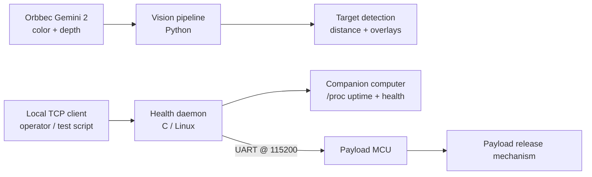

# Drone Onboard Systems

Onboard companion-computer software for an autonomous drone system, developed around the **AEAC Fire Reconnaissance UAS Competition**. This repository collects the higher-level software that runs alongside the flight controller, including perception, payload-control support, daemon health reporting, and bench-test tooling.

The current codebase is split into two main companion-computer subsystems:

- **Vision pipeline**: real-time color/depth processing using an Orbbec Gemini 2 depth camera
- **Health daemon**: lightweight Linux C daemon for local command handling, system health reporting, and UART communication with the payload MCU

## Repository layout

```text
.
└── companion/
    ├── health_daemon/
    │   ├── healthd.c
    │   └── README.md
    └── vision/
        ├── README.md
        ├── main.py
        ├── camera.py
        ├── segmentation.py
        ├── ransac_worker.py
        ├── vision_app.py
        ├── renderer.py
        ├── shared_state.py
        ├── yolo_worker.py
        └── config.py
```

## System overview



The companion computer is responsible for running perception and support services that sit above the low-level flight controller. The vision stack handles target perception from synchronized color/depth frames, while the health daemon provides a simple local TCP interface for testing and forwarding payload-control commands over UART.

## Subsystems

### `companion/vision`

Real-time vision pipeline for the AEAC Fire Reconnaissance UAS mission, built around the **Orbbec Gemini 2** depth camera.

Key features:

- Streams synchronized color and depth frames
- Aligns depth to the color image
- Detects colored circular targets using HSV segmentation
- Estimates target distance from depth data
- Fits dominant planes using RANSAC
- Displays live overlays and debug views
- Includes an optional YOLO worker for landmark detection

See [`companion/vision/README.md`](companion/vision/README.md) for pipeline details and run instructions.

### `companion/health_daemon`

Lightweight Linux daemon written in C for payload-subsystem health and command handling.

Key features:

- Starts a local TCP command server on `127.0.0.1:5050`
- Reports daemon liveness and Linux uptime from `/proc/uptime`
- Tracks accumulated daemon errors using a bitmask
- Opens a UART connection to the payload MCU at `115200` baud
- Forwards commands such as `LOCK`, `ARM`, `RELEASE`, `RETRACT`, and `DISTANCE`
- Provides `SIM_*` commands for bench-testing state-machine behavior without hardware attached
- Handles `SIGINT` and `SIGTERM` for clean shutdown

See [`companion/health_daemon/README.md`](companion/health_daemon/README.md) for build instructions, command references, and simulation examples.

## Quick start

### Run the vision pipeline

```bash
cd companion/vision
python main.py
```

Requirements:

- Orbbec Gemini 2 depth camera
- Direct USB 3 connection recommended
- No other process using `/dev/video*`

### Build and run the health daemon

```bash
cd companion/health_daemon
gcc -Wall -Wextra -std=c11 -o healthd healthd.c
./healthd
```

In another terminal:

```bash
nc 127.0.0.1 5050
```

Example daemon commands:

```text
STATUS
SIM_DISTANCE 20
SIM_ARM
SIM_RELEASE
SIM_RETRACT
SIM_LOCK
EXIT
```

## Development notes

This repository is organized around small, testable onboard services rather than one monolithic application. Each subsystem has its own README with more detailed build/run instructions and behavior notes.

The current focus areas are:

- Robust perception under changing lighting, compression, and frame-failure conditions
- Simple and observable payload-control support from the Linux companion computer
- Bench-test workflows that allow subsystem validation without requiring the full drone stack
- Clear subsystem documentation for bring-up, debugging, and future integration

## Project context

This project was developed as part of McMaster Aerial Drones & Robotics work for the AEAC Fire Reconnaissance UAS competition. The onboard software supports mission-level capabilities such as target detection, depth-based estimation, payload-control testing, and companion-computer health monitoring.
