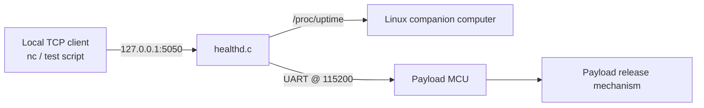

# Health Daemon

`healthd.c` is a lightweight Linux companion-computer daemon for the drone payload subsystem. It exposes a local TCP command interface, reports basic daemon health, and forwards payload-control commands to the payload MCU over UART.

It also includes simulation commands so the payload state-machine logic can be tested from a terminal without requiring the physical MCU or actuator hardware.

## What it does

- Starts a TCP server on `127.0.0.1:5050`
- Accepts simple line-based commands from a local client such as `nc`
- Reports companion-computer uptime using `/proc/uptime`
- Tracks daemon health through an accumulated error bitmask
- Opens a UART connection to the payload MCU at `115200` baud
- Forwards hardware commands such as `LOCK`, `ARM`, `RELEASE`, `RETRACT`, and `DISTANCE` to the MCU
- Provides `SIM_*` commands for bench testing the daemon-side payload state machine
- Handles `SIGINT` and `SIGTERM` for clean shutdown

## Architecture



The daemon is intended to run on the drone companion computer. Local software, test scripts, or an operator shell can connect over TCP and issue commands. Hardware-backed commands are sent to the payload MCU over UART, while simulation commands update daemon-side state directly.

## Current configuration

These values are defined near the top of `healthd.c`:

| Constant | Value | Purpose |
| --- | --- | --- |
| `IP_ADDR` | `127.0.0.1` | Localhost bind address |
| `PORT` | `5050` | TCP command port |
| `MAX_CLIENTS` | `2` | TCP listen backlog |
| `TIMEOUT` | `2000` | `poll()` timeout in milliseconds |
| `BAUD_RATE` | `B115200` | UART baud rate |
| `THRESHOLD` | `30` | Maximum simulated release distance |
| `MIN_DIST` / `MAX_DIST` | `0` / `100` | Valid simulated distance range |
| `HARDWARE_PORT` | `/dev/serial/by-id/usb-STMicroelectronics_STM32_STLink_066DFF525650657287242939-if02` | Payload MCU serial device |

If the MCU appears under a different Linux serial path, update `HARDWARE_PORT` before building.

## Build

From this directory:

```bash
gcc -Wall -Wextra -std=c11 -o healthd healthd.c
```

## Run

```bash
./healthd
```

The daemon binds to localhost only. In another terminal, connect with:

```bash
nc 127.0.0.1 5050
```

Then type commands one per line.

## Example simulation session

```text
STATUS
SIM_DISTANCE 20
SIM_ARM
SIM_RELEASE
SIM_RETRACT
SIM_LOCK
STATUS
EXIT
```

Expected behavior:

1. `SIM_DISTANCE 20` sets the simulated distance below the release threshold.
2. `SIM_ARM` transitions the simulated payload state from `LOCKED` to `ARMED`.
3. `SIM_RELEASE` transitions from `ARMED` to `RELEASING` only if the distance is within the allowed threshold.
4. `SIM_RETRACT` transitions from `RELEASING` to `RETRACTING`.
5. `SIM_LOCK` returns the simulated payload state to `LOCKED` unless the current state is `RELEASING`.

## Command reference

| Command | Type | Description |
| --- | --- | --- |
| `UPTIME` | Local | Returns daemon liveness and Linux uptime from `/proc/uptime` |
| `STATUS` | Local | Reports daemon health, MCU link status, simulated payload state, and error bitmask |
| `HELP` | Local | Lists supported commands |
| `EXIT` | Local | Closes the current TCP client session |
| `LOCK` | Hardware | Sends `LOCK` to the payload MCU over UART |
| `ARM` | Hardware | Sends `ARM` to the payload MCU over UART |
| `RELEASE` | Hardware | Sends `RELEASE` to the payload MCU over UART |
| `RETRACT` | Hardware | Sends `RETRACT` to the payload MCU over UART |
| `DISTANCE` | Hardware | Requests distance information from the payload MCU over UART |
| `SIM_LOCK` | Simulation | Sets simulated payload state to `LOCKED`, except from `RELEASING` |
| `SIM_ARM` | Simulation | Transitions simulated payload state from `LOCKED` to `ARMED` |
| `SIM_RELEASE` | Simulation | Transitions simulated state from `ARMED` to `RELEASING` if distance is within threshold |
| `SIM_RETRACT` | Simulation | Transitions simulated state from `RELEASING` to `RETRACTING` |
| `SIM_DISTANCE <cm>` | Simulation | Sets simulated distance, valid from `0` to `100` |
| `SIM_FAULT` | Simulation | Forces simulated payload state to `FAULT` |
| `SIM_RESET_FAULT` | Simulation | Returns simulated payload state from `FAULT` to `LOCKED` |

## Simulated payload states

The daemon tracks the following simulated payload states:

```text
LOCKED -> ARMED -> RELEASING -> RETRACTING
                  \-> FAULT, through SIM_FAULT
```

Important transition rules:

- `SIM_ARM` is only valid from `LOCKED`.
- `SIM_RELEASE` is only valid from `ARMED`.
- `SIM_RELEASE` is blocked if `distance > THRESHOLD`.
- `SIM_RETRACT` is only valid from `RELEASING`.
- `SIM_RESET_FAULT` only works when the simulated state is `FAULT`.

## Error bitmask

`STATUS` reports accumulated daemon errors as a hexadecimal bitmask. Each bit corresponds to one error source:

| Error | Hex | Meaning |
| --- | ---: | --- |
| `ERR_UART_TX` | `0x1` | UART write failed |
| `ERR_UART_RX` | `0x2` | UART read failed |
| `ERR_TCP_BIND` | `0x4` | TCP socket bind failed |
| `ERR_INVALID_CMD` | `0x8` | Client sent an unsupported command |
| `ERR_BAD_TRANSITION` | `0x10` | Invalid simulated state transition |
| `ERR_MCU_OFFLINE` | `0x20` | UART command attempted while MCU link is offline |
| `ERR_UPTIME` | `0x40` | Failed to read uptime |
| `ERR_OPEN_FD` | `0x80` | Failed to open a required file descriptor |
| `ERR_UART_INIT` | `0x100` | UART initialization failed |
| `ERR_TCP_LISTEN` | `0x200` | TCP listen failed |
| `ERR_TCP_ACCEPT` | `0x400` | TCP accept failed |
| `ERR_TCP_CONNECT` | `0x800` | TCP connection polling failed |
| `ERR_CLIENT_REQUEST` | `0x1000` | Client request handling failed |

Example:

```text
errors=0x110
```

This means `ERR_UART_INIT` and `ERR_BAD_TRANSITION` are currently set.

## Notes for testing

- Use the `SIM_*` commands for daemon-only testing without the MCU attached.
- Use `STATUS` after each command to confirm state and error behavior.
- Hardware commands require the configured serial device to exist and the MCU firmware to respond over UART.
- Because the TCP server binds to `127.0.0.1`, it is only reachable from the local companion computer unless the bind address is changed.

## File layout

```text
companion/health_daemon/
├── healthd.c
└── README.md
```
