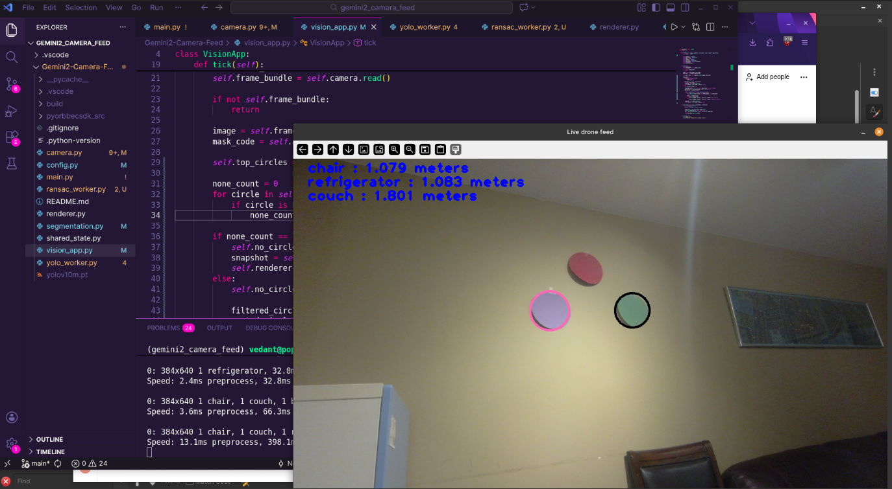
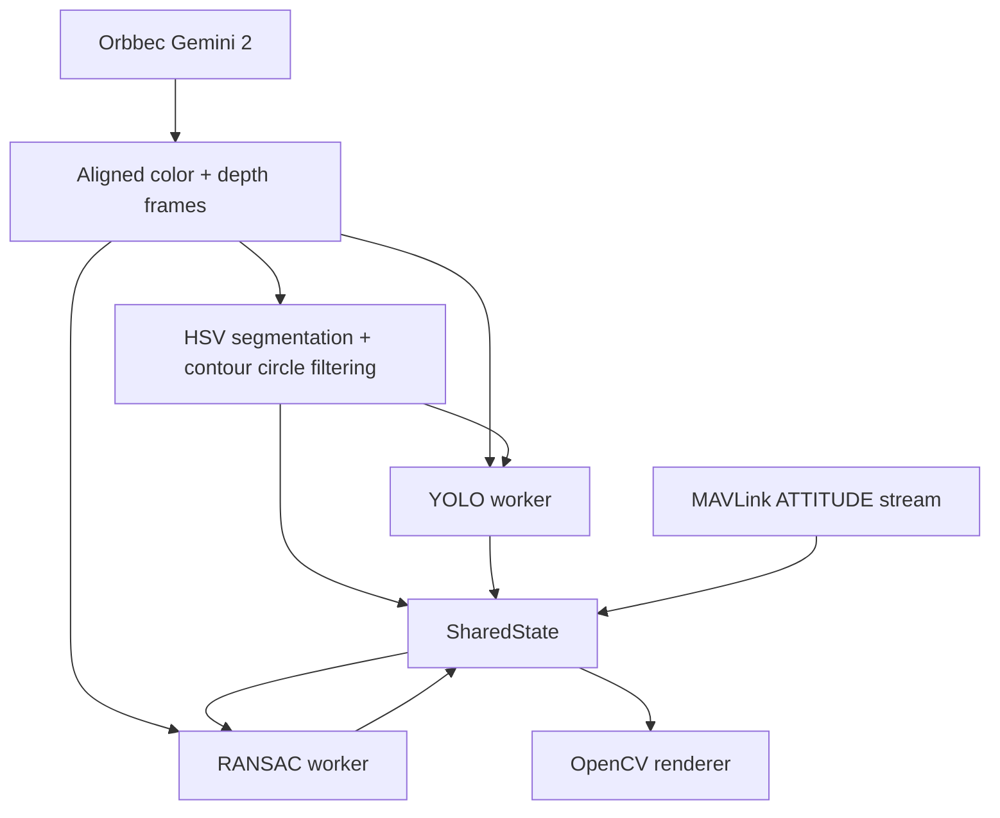

# Vision Pipeline

Real-time companion-computer vision pipeline for the **AEAC Fire Reconnaissance UAS Competition**, built around the **Orbbec Gemini 2 depth camera**.

The current implementation combines Orbbec color/depth capture, HSV target segmentation, optional YOLO landmark inference, RANSAC plane/wall estimation, and MAVLink attitude input from the flight controller or SITL.



## What this does

- Streams synchronized color and depth frames from an Orbbec Gemini 2
- Aligns depth to the color stream with `pyorbbecsdk`
- Filters depth readings to the configured valid range of `20 mm` to `10000 mm`
- Detects colored circular targets using HSV masks and contour geometry
- Keeps the best circular target candidates by roundness
- Runs YOLO inference on a background worker at a configured frame interval
- Estimates target-to-landmark distance from depth-projected 3D points
- Runs RANSAC on sampled depth points to estimate a dominant non-ground plane/wall
- Uses MAVLink `ATTITUDE` messages for pitch/roll input during RANSAC
- Renders a live OpenCV display with target, landmark, and plane overlays

## Runtime data flow



## Project structure

```text
companion/vision/
├── README.md
├── camera.py          # Orbbec stream setup, frame sync, depth alignment, frame conversion
├── config.py          # AppConfig: depth limits, HSV ranges, window size, YOLO path, mask code
├── demo.png           # Example output image
├── main.py            # Entry point and subsystem wiring
├── mavlink.py         # pymavlink connection and ATTITUDE reader
├── ransac_worker.py   # Plane/wall estimation from depth points
├── renderer.py        # OpenCV display and overlay rendering
├── segmentation.py    # HSV masks, morphology, contour filtering, circle scoring
├── shared_state.py    # Thread-safe state shared between workers and renderer
├── vision_app.py      # Main per-frame application loop
└── yolo_worker.py     # Ultralytics YOLO worker and landmark-distance estimation
```

## Main components

### Camera

`camera.py` creates an Orbbec `Pipeline`, enables the default color and depth stream profiles, turns on frame sync, aligns depth to the color stream, and retries frame capture before failing the current read.

Supported color formats in the conversion path include `RGB`, `BGR`, `YUYV`, `MJPG`, `I420`, `NV12`, `NV21`, and `UYVY`.

### Color segmentation

`segmentation.py` detects colored circular targets without Hough circles. The pipeline uses:

- Gaussian blur before HSV conversion
- HSV threshold masks selected by `mask_code`
- Morphological close/open filtering
- Contour extraction
- Area, radius, fill, solidity, and roundness checks

The default entry point uses:

```python
AppConfig("yolov10n.pt", "rp")
```

So the default target masks are **red** and **purple**.

Supported mask-code letters:

| Letter | Color |
| --- | --- |
| `r` | red |
| `b` | blue |
| `g` | green |
| `y` | yellow |
| `p` | purple |
| `o` | orange |

### YOLO landmark worker

`yolo_worker.py` loads the model from `AppConfig.model_path` and runs inference asynchronously. When landmarks are detected, it uses Orbbec depth projection to estimate 3D distance between the selected target circle and each landmark, then stores distances in meters in `SharedState`.

YOLO is submitted every `AppConfig.yolo_interval` frames after a target is detected. The current default interval is `20` frames.

### MAVLink attitude reader

`mavlink.py` opens a pymavlink connection using:

```python
udpin:localhost:14540
```

`main.py` requests `ATTITUDE` at `50 Hz` and starts a background reader thread. The RANSAC worker waits for pitch/roll before attempting plane estimation, so a MAVLink heartbeat and attitude stream should be available when running the full app.

For bench testing only the camera/segmentation path, stub out the `Mavlink` dependency or provide a local SITL/autopilot endpoint.

### RANSAC worker

`ransac_worker.py` samples depth pixels, converts valid depth samples to 3D points, randomly fits candidate planes, counts inliers, rejects planes aligned with the gravity estimate, and stores the best wall/plane estimate in `SharedState`.

Current defaults in `submit_job()` use:

- distance threshold: `50`
- iterations: `300`
- inlier/normal threshold argument: `0.9`
- sample rate in `RansacJob`: `8`

## Requirements

Hardware:

- Orbbec Gemini 2 depth camera
- Direct USB 3 connection recommended
- Companion computer with enough CPU/GPU headroom for OpenCV + YOLO
- Flight-controller/SITL MAVLink endpoint for full RANSAC operation

Python/runtime dependencies used by the code:

- `pyorbbecsdk`
- `opencv-python`
- `numpy`
- `ultralytics`
- `pymavlink`

The Orbbec SDK may need to be installed from Orbbec's Python SDK distribution depending on the target machine.

## Running

From this directory:

```bash
python main.py
```

Controls:

```text
q or ESC: quit
```

Before running the full pipeline, check that:

- The Orbbec camera is connected and not being used by another process
- The YOLO model path in `AppConfig` exists, defaulting to `yolov10n.pt`
- A MAVLink heartbeat is available at `udpin:localhost:14540`
- The target colors match the active `mask_code`

## Configuration

Most tuning values live in `config.py`.

| Setting | Current default | Purpose |
| --- | ---: | --- |
| `min_depth` | `20` | Minimum accepted depth in millimeters |
| `max_depth` | `10000` | Maximum accepted depth in millimeters |
| `yolo_interval` | `20` | Run YOLO every N frames after target detection |
| `window_width` | `1280` | Display width |
| `window_height` | `720` | Display height |
| `model_path` | `yolov10n.pt` | YOLO model file |
| `mask_code` | `rp` from `main.py` | Active HSV target colors |

HSV thresholds for red, blue, green, yellow, purple, and orange are also defined in `AppConfig`.

## Current integration notes

- `main.py` currently wires together camera, segmentation, YOLO, MAVLink, RANSAC, renderer, shared state, and logging in one entry point.
- The full app expects MAVLink to be available before the vision loop starts because `Mavlink.__init__()` waits for a heartbeat.
- RANSAC depends on pitch/roll data from the MAVLink attitude stream.
- The wall-overlay path should be validated during integration; the RANSAC worker stores wall hull data through `SharedState` and the renderer consumes the snapshot.
- This is bench/integration software and should be validated with recorded or controlled test cases before flight use.

## Troubleshooting

| Symptom | Things to check |
| --- | --- |
| App does not start after creating `Mavlink` | Confirm SITL/autopilot heartbeat on `localhost:14540` |
| No camera frames | Check USB 3 connection, Orbbec SDK install, and whether another process owns the camera |
| No targets detected | Confirm `mask_code`, lighting, HSV thresholds, target size, and target color |
| YOLO never reports landmarks | Confirm model file path, model classes, and whether detections overlap valid depth pixels |
| RANSAC does not update wall estimate | Confirm valid depth coverage and MAVLink pitch/roll updates |
