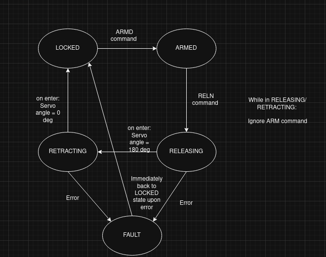

# Payload Release Controller (ESP32)

## Overview

This module implements a deterministic, safety-gated payload release controller for a UAV system.  
It runs on an ESP32 and communicates with a companion computer (Jetson) over UART.  
The controller manages a servo-actuated latch using a non-blocking finite state machine (FSM) with explicit timing guarantees and fault handling.

The design prioritizes:
- Deterministic actuator behavior  
- Explicit state transitions  
- Safety gating (ARM required before release)  
- Immediate fault override  

---

## System Context

Jetson (Companion Computer)  
→ UART command interface  
→ STM32 payload controller  
→ Servo-actuated mechanical latch  

The Jetson issues high-level commands (ARM, RELEASE, LOCK, STOP).  
The ESP32 handles all timing and actuator sequencing internally.

---

## Command Protocol

All commands are fixed-length 4-character ASCII tokens.

| Command | Description | Valid From | Behavior |
|---------|-------------|-------------|----------|
| `LOCK`  | Force latch to locked position | Any | Immediately retracts servo |
| `ARMD`  | Arm the release system | LOCKED | Enables release command |
| `RELS`  | Initiate release sequence | ARMED | Starts timed release → retract sequence |
| `STOP`  | Enter fault state | Any | Immediately retracts and enters FAULT |

**Planned protocol extensions (in development):**
- Slot-indexed release commands (`REL1`, `REL2`, `REL3`, …)
- Structured `OK` / `ERR` acknowledgements
- `STAT` command for state reporting

---

## State Machine

The controller is implemented as a non-blocking FSM:

**States**
- `LOCKED`
- `ARMED`
- `RELEASING`
- `RETRACTING`
- `FAULT`

**Transitions**
- `LOCKED --(ARMD)--> ARMED`
- `ARMED --(RELS)--> RELEASING`
- `RELEASING --(t >= RELEASE_MS)--> RETRACTING`
- `RETRACTING --(t >= RETRACT_MS)--> LOCKED`
- `ANY --(STOP)--> FAULT`

Timing logic is fully non-blocking (using `millis()`).

**Motion state rules**
- During `RELEASING` / `RETRACTING`:  
  Only safety-critical commands (e.g., `STOP`) are accepted.  
- Release cannot occur unless the system is in `ARMED`.

---

## Safety Design

- Release is gated by the ARMED state.
- `STOP` overrides all motion and forces immediate retract.
- `FAULT` is sticky until explicitly reset.
- On startup, the latch returns to locked position.

**Planned safety upgrades (in production):**
- Acknowledgement protocol (`OK <cmd>`, `ERR <code>`)
- Slot-level release tracking (prevents double-release)
- Deadman timers for motion states
- Robust malformed-command handling

---

## Implementation Details

- **Platform:** STM32 (STM32CubeIDE)  
- **Servo control:** ESP32Servo library  
- **Timing:** Non-blocking `millis()`-based state machine  
- **Design style:** Centralized FSM with deterministic transitions  

---

## Status

**Current implementation includes:**
- UART command parsing  
- Deterministic state machine  
- Timed release + retract cycle  
- Fault override capability  

**In active development:**
- Multi-slot release (`REL1`, `REL2`, …)
- Structured ACK/NACK responses  
- Enhanced system diagnostics  
- Expanded documentation  

---
